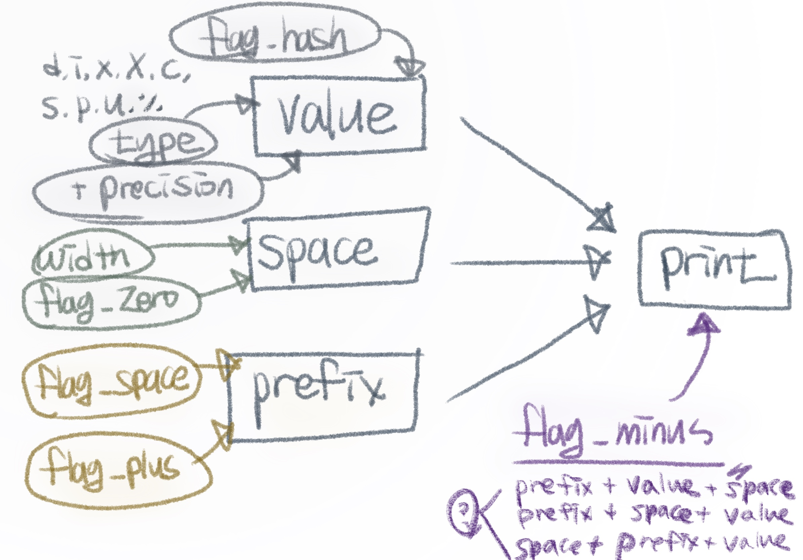

# Make your own printf function!

## header
"t_options' is a structure for storing information about options. "flag_minus" to "type" are the basic options in the printf function. "value" to "prefix" are a tool for making the converse string more easily.  
- "*value" is a string after 'variable argument' converted to 'char *'
- "*space" is a string with zero or space for the option 'width'. 
- "*prefix" and "val_minus" are variables for checking whether the input variable argument is positive or negative. 
- "val_zero" and "val_null" are for exceptional cases where the value is zero or null.  
- "strlen" checks for a length of "string", "string + precision", "print". 
- "malloc_error" is a variable about telling malloc error. If memory allocation fails, then this flag turns to 1. 

```c
typedef struct t_options_type {
	int		flag_minus;
	int		flag_plus;
	int		flag_space;
	int		flag_zero;
	int		flag_hash;
	int		width;
	int		width_have;
	int		precision;
	int		precision_have;
	int		type;
	char	*value;
	char	*space;
	char	*prefix;
	char	*print;
	int		val_minus;
	int		val_zero;
	int		val_null;
	int		strlen;
	int		malloc_error;
}	t_options;
```


## printf
The basic concept of my printf is :
- From the beginning to the end of the string
- If a char is '\0', it means the end of the string; break the loof
- If a char is '%', move the address collecting the options until it finds the 'type' and apply the options.
- If a char is other than '\0' or '%', write the char immediately. 
### printf
```c
int	ft_printf(const char *format, ...)
{
	size_t		index;
	va_list		ap;
	t_options	*string_info;
	int			strlen;

	strlen = 0;
	string_info = (t_options *)malloc(sizeof(t_options));
	if (string_info == NULL)
		return (-1);
	va_start(ap, format);
	if (printer(format, &ap, string_info, &strlen) == -1)
		return (ft_error_quit(&ap, string_info));
	return (ft_free_fin(&ap, string_info, strlen));
}
```
```c
static int	printer(const char *format, va_list *ap, \
t_options *string_info, int *strlen)
{
	size_t		index;
	int			check;

	index = 0;
	while (*(format + index))
	{
		if (ft_percent_or_other(*(format + index)) == -1)
			break ;
		else if (ft_percent_or_other(*(format + index)) == 1)
		{
			if (conversion(format, &index, string_info) == -1)
				return (-1);
			check = ft_apply_option(ap, string_info);
			ft_free_options(string_info);
			if (check == -1)
				return (-1);
			(*strlen) += check;
		}
		else if (ft_percent_or_other(*(format + index)) == 2)
			ft_putchar(*(format + index++), strlen);
	}
	return (0);
}
```
```c
void	ft_free_options(t_options *string_info)
{
	if (string_info->value != NULL)
		free(string_info->value);
	if (string_info->space != NULL)
		free(string_info->space);
	if (string_info->print != NULL)
		free(string_info->print);
}
```
### variable argument   
The include file <stdarg.h> declares a type (va_list) and defines three macros for stepping through a list of arguments whose number and types are not known to the called function. The called function must declare an object of type va_list which is used by the macros va_start(), va_arg(), va_copy(), and va_end()  

The va_arg(), va_end(), and va_start() macros access the arguments to a function when it takes a fixed number of required arguments and a variable number of optional arguments. You declare required arguments as ordinary parameters to the function and access the arguments through the parameter names.  

**va_start(va_list ap, last)**  
The va_start() macro initializes the arg_ptr pointer for subsequent calls to va_arg() and va_end().   

**va_arg(va_list ap, type)**  
The va_arg() macro retrieves a value of the given var_type from the location given by arg_ptr and increases arg_ptr to point to the next argument in the list. The va_arg() macro can retrieve arguments from the list any number of times within the function.  

**va_end(va_list ap)**  
The va_end() macro is needed by some systems to indicate the end of parameter scanning.  

**va_copy(va_list dest, va_list src)**   
The va_copy() function creates a copy (dest) of a variable of type va_list (src). The copy appear as if it has gone through a va_start() and the exact set of sequences of va_arg() as that of src.  

**reference**:
[IBM Document](https://www.ibm.com/docs/en/zos/2.3.0?topic=lf-va-arg-va-copy-va-end-va-start-access-function-arguments), man  

**example**
```c
/* CELEBV01                                      

   This example passes a variable number of arguments to a function,            
   stores each argument in an array, and prints each argument.                  

 */                                                                             
#include <stdio.h>                                                              
#include <stdarg.h>                                                             
                                                                                
void vout(int max, ...);                                                        
                                                                                
int main(void)                                                                  
{                                                                               
   vout(3, "Sat", "Sun", "Mon");                                                
   printf("\n");                                                                
   vout(5, "Mon", "Tues", "Wed", "Thurs", "Fri");                               
}                                                                               
                                                                                
void vout(int max, ...)                                                         
{                                                                               
   va_list arg_ptr;                                                             
   int args = 0;                                                                
   char *days[7];                                                               
                                                                                
   va_start(arg_ptr, max);                                                      
   while(args < max)                                                            
   {                                                                            
      days[args] = va_arg(arg_ptr, char *);                                     
      printf("Day:  %s  \n", days[args++]);                                     
      }                                                                         
   va_end(arg_ptr);                                                             
}                                                                             
```
                                                                             
## Major functions
### conversion
Check flag, width, precision, type, and finish the function if occurred an option error. 
```c
static int	conversion(const char *format, \
size_t *index, t_options *string_info)
{
	(*index)++;
	ft_memset(string_info, 0, sizeof(t_options));
	while (ft_flag_checker(*(format + (*index))))
		ft_flag_check(*(format + (*index)), string_info, index);
	ft_width_check(format, index, string_info);
	if (*(format + (*index)) == '.')
		ft_precision_check(format, index, string_info);
	if (ft_type_checker(*(format + (*index))) == 0)
		return (-1);
	string_info->type = *(format + (*index));
	if (string_info->type == '%')
		string_info->flag_zero = 0;
	(*index)++;
	return (ft_option_error(string_info));
}
```

### percent or other
Find whether print the char immediately, collet and apply the options, or finish the function. 
```c
int	ft_percent_or_other(char c)
{
	if (c == '%')
		return (1);
	else if (c == '\0')
		return (-1);
	return (2);
}
```
### option error
Cases about option errors. 
```c
int	ft_option_error(t_options *string_info)
{
	if (string_info->type == 'c' || string_info->type == 'p')
		if (string_info->precision > 0 || string_info->flag_zero == 1 \
		|| string_info->flag_hash == 1 || string_info->flag_space == 1 \
		|| string_info->flag_plus == 1)
			return (-1);
	if (string_info->type == 'c' || string_info->type == 's' \
	|| string_info->type == 'p')
		if (string_info->flag_zero == 1 || string_info->flag_hash == 1 \
		|| string_info->flag_space == 1 || string_info->flag_plus == 1)
			return (-1);
	if (string_info->type == 'd' || string_info->type == 'i' \
	|| string_info->type == 'u')
		if (string_info->flag_hash == 1)
			return (-1);
	if (string_info->type == 'u' || string_info->type == 'x' \
	|| string_info->type == 'X')
		if (string_info->flag_space == 1 || string_info->flag_plus == 1)
			return (-1);
	if (string_info->flag_zero == 1 && string_info->flag_minus == 1)
		return (-1);
	return (0);
}
```
### apply option
```c
int	ft_apply_option(va_list *ap, t_options *string_info)
{
	int	type;

	type = ft_type_checker(string_info->type);
	if (type == 1)
		ft_apply_int(string_info, va_arg(*ap, int));
	else if (type == 2)
		ft_apply_percent(string_info, '%');
	else if (type == 3)
		ft_apply_string(string_info, va_arg(*ap, char *));
	else if (type == 4)
		ft_apply_pointer(string_info, va_arg(*ap, unsigned long long));
	else if (type == 5)
		ft_apply_unsigned_int(string_info, va_arg(*ap, unsigned int));
	if (string_info->value != NULL)
		string_info->strlen = ft_strlen(string_info->value);
	ft_apply_precision(string_info);
	ft_apply_width(string_info);
	ft_apply_flag(string_info);
	if (string_info->malloc_error == 1)
		return (-1);
	ft_print_t_options(string_info);
	return (string_info->strlen);
}
```
### apply precision; string type
```c
static void	ft_apply_precision(t_options *string_info)
{
	char	*string;
	char	*new_string;
	int		precision;

	if (string_info->precision_have == 0 || string_info->malloc_error == 1)
		return ;
	precision = string_info->precision;
	string = string_info->value;
	if (string == NULL || string_info->type == 's')
	{
		if (string == NULL)
			new_string = new_string_with_this('0', precision);
		else if (string_info->type == 's')
			new_string = ft_substr(string, 0, precision);
		if (new_string == NULL)
			return (ft_malloc_error_void(string_info));
		string_info->value = new_string;
		free(string);
		return ;
	}
	precision_number(string_info, string, precision);
}
```
### apply precision; number
```c
static void	precision_number(t_options *string_info, char *string, \
int precision)
{
	char	*cpy_string;
	char	*new_string;

	if (string_info->val_zero == 1)
		return (precision_zero(string_info, string, precision));
	if (string_info->val_minus == 1)
		cpy_string = ft_get_cpy_with_this(string_info, '0', precision + 1);
	else
		cpy_string = ft_get_cpy_with_this(string_info, '0', precision);
	if (string_info->malloc_error == 1 || cpy_string == NULL)
		return ;
	new_string = ft_strjoin(cpy_string, string);
	if (new_string == NULL)
		return (ft_malloc_error_void(string_info));
	string_info->value = new_string;
	free(string);
	free(cpy_string);
}
```
```c
static void	precision_zero(t_options *string_info, char *string, \
int precision)
{
	char	*cpy_string;

	cpy_string = new_string_with_this('0', precision);
	if (cpy_string == NULL)
		return (ft_malloc_error_void(string_info));
	string_info->value = cpy_string;
	free(string);
}
```
### apply width
```c
static void	ft_apply_width(t_options *string_info)
{
	char	*cpy_string;
	char	*string;

	string = string_info->value;
	if ((string_info->width_have == 0) || (string_info->malloc_error == 1) \
	|| (ft_strlen(string) >= string_info->width))
		return ;
	if ((string_info->val_null == 1) || ((string_info->val_minus == 0) \
	&& (string_info->flag_space == 1 || string_info->flag_plus == 1)))
		cpy_string = \
		ft_get_cpy_with_this(string_info, ' ', string_info->width - 1);
	else if (string_info->flag_hash == 1 && string_info->val_zero == 0)
		cpy_string = \
		ft_get_cpy_with_this(string_info, ' ', string_info->width - 2);
	else
		cpy_string = ft_get_cpy_with_this(string_info, ' ', string_info->width);
	if (string_info->malloc_error == 1 || cpy_string == NULL)
		return ;
	string_info->space = cpy_string;
}
```
### apply flag
```c
void	ft_apply_flag(t_options *string_info)
{
	ft_apply_flag_hash(string_info);
	ft_apply_flag_zero(string_info);
	ft_apply_flag_space(string_info);
	ft_apply_flag_plus(string_info);
	ft_apply_flag_minus(string_info);
}
```
### flag hash
```c
static void	flag_hash(t_options *string_info)
{
	if (string_info->flag_hash == 0 || string_info->val_zero == 1 \
	|| string_info->malloc_error == 1)
		return ;
	if (string_info->type == 'x')
		string_info->prefix = "0x";
	else if (string_info->type == 'X')
		string_info->prefix = "0X";
}
```
### flag space
If the value is plus, make the prefix " " and if the value is minus, set the prefix "-"
```c
static void	flag_space(t_options *string_info)
{
	if (string_info->val_minus == 1)
		string_info->prefix = "-";
	if (string_info->flag_space == 0 || string_info->malloc_error == 1)
		return ;
	else if (string_info->val_minus == 0)
		string_info->prefix = " ";
}
```
### flag zero
Replace spaces with zeroes.
```c
static void	flag_zero(t_options *string_info)
{
	if (string_info->flag_zero == 0 || string_info->space == NULL \
	|| (string_info->precision_have == 1 \
	&& string_info->width - string_info->strlen > 0) \
	|| (string_info->malloc_error == 1) \
	|| (string_info->val_zero == 1 && string_info->width == 1))
		return ;
	ft_memset(string_info->space, '0', ft_strlen(string_info->space));
}
```
### flag plus
If the value is plus, make the prefix "+" and if the value is minus, set the prefix "-"
```c
static void	flag_plus(t_options *string_info)
{
	if (string_info->flag_plus == 0 || (string_info->malloc_error == 1))
		return ;
	if (string_info->val_minus == 0)
		string_info->prefix = "+";
}
```
### flag minus
```c
void	ft_apply_flag_minus(t_options *string_info)
{
	if (string_info->malloc_error == 1)
		return ;
	if (string_info->flag_minus == 1)
		minus_have(string_info);
	else
		minus_have_not(string_info);
}
```
### flag minus; have a flag minus
```c
static void	minus_have(t_options *string_info)
{
	char	*string;
	char	*prefix;
	char	*space;
	int		len;

	prefix = string_info->prefix;
	space = string_info->space;
	if (string_info->val_null == 1)
	{
		if (space != NULL)
			len = ft_strlen(space);
		string = ft_new_string(len + 2);
		if (string == NULL)
			return (ft_malloc_error_void(string_info));
		string[0] = '\0';
		ft_memset(string + 1, ' ', len);
		string[len + 2] = '\0';
		string_info->print = string;
		return ;
	}
	string = ft_strjoin_three(prefix, string_info->value, space);
	if (string == NULL)
		return (ft_malloc_error_void(string_info));
	string_info->print = string;
}
```
### flag minus; doesn't have a flag minus
```c
static void	minus_have_not(t_options *string_info)
{
	char	*string;
	char	*prefix;
	char	*space;

	prefix = string_info->prefix;
	space = string_info->space;
	if ((string_info->flag_zero == 1 && string_info->precision_have == 0) \
	|| (string_info->width_have == 0 && string_info->precision_have == 1))
		string = ft_strjoin_three(prefix, space, string_info->value);
	else
		string = ft_strjoin_three(space, prefix, string_info->value);
	if (string == NULL)
		return (ft_malloc_error_void(string_info));
	string_info->print = string;
}
```
#### ft_strjoin_three
Join three strings orderly. If one or two of them is null, ignore it.
```c
char	*ft_strjoin_three(char	*s1, char *s2, char *s3)
{
	char	*string;
	char	*tmp;

	if (s1 != NULL && s2 != NULL && s3 != NULL)
	{
		tmp = ft_strjoin(s1, s2);
		string = ft_strjoin(tmp, s3);
		free(tmp);
	}
	else if (!s1 && s2 != NULL && s3 != NULL)
		string = ft_strjoin(s2, s3);
	else if (!s2 && s1 != NULL && s3 != NULL)
		string = ft_strjoin(s1, s3);
	else if (!s3 && s1 != NULL && s2 != NULL)
		string = ft_strjoin(s1, s2);
	else if (s1)
		string = ft_new_string_with_value(s1);
	else if (s2)
		string = ft_new_string_with_value(s2);
	else
		string = ft_new_string_with_value(s3);
	return (string);
}
```
### print options
```c
void	ft_print_t_options(t_options *string_info)
{
	int		strlen;

	strlen = 0;
	if (string_info->print != NULL)
		strlen = ft_strlen(string_info->print);
	if (string_info->val_null == 1)
	{
		strlen = 1;
		if (string_info->space != NULL)
			strlen += ft_strlen(string_info->space);
	}
	write(1, string_info->print, strlen);
	string_info->strlen = strlen;
}
```